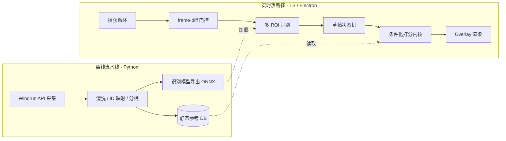
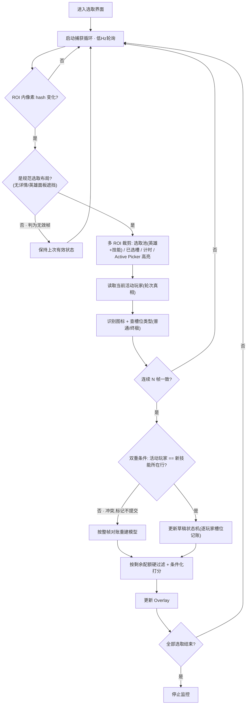

# Dota 2 Ability Draft 选取助手 · 计划书

## 一句话定调

全新构建一个 Windows 桌面 AD 选取助手,采用「**Python 离线数据/模型流水线 + TypeScript/Electron 实时热路径**」的双层架构。区别于 ability-draft-plus 的"手动点击触发一次解析",本助手从进入选取界面起**持续监控**直到选取结束;打分不再只依赖 Windrun 单技能胜率排行,而是综合已选技能、神杖效果、搭配与截胡价值的**条件化打分内核**。

---

## 一、项目定位与核心差异化

对标已开源的 ability-draft-plus,本项目的价值不在"重做一个 overlay",而在三处明确的能力升级:持续监控、条件化打分、槽位约束感知。整张计划书都围绕这几点展开。

### 差异化 1:从「点击触发」到「持续监控」

ability-draft-plus 的模式是被动的——用户手动点击,才跑一遍截屏→解析→打分。这导致状态是**离散快照**,无法感知选取过程的动态(谁刚拿了什么、池子如何收缩)。

本助手改为 **push 式持续监控**:进入选取界面即启动捕获循环,持续观察技能池、十行已选槽、回合计时,直到全部技能选完才停止。这要求一套全新的工程骨架——捕获循环、多 ROI 探头、草稿状态机、frame-diff 门控——是本项目最主要的工程投入,也是简历上最能讲的系统设计部分。

### 差异化 2:从「单技能胜率排行」到「条件化打分」

ability-draft-plus 主要消费 Windrun 的单技能胜率排行,本质是一张静态榜单。问题是 AD 的强度高度依赖**上下文**:同一个技能在不同英雄、不同已选组合、有无神杖时价值差异巨大。

本助手的打分内核是**条件化**的,综合考虑:

- **已选技能搭配**:基于 Windrun `ability-pairs`,评估候选技能与本人已选技能的协同。
- **神杖效果**:部分技能拿到神杖后强度质变,需将神杖收益纳入价值评估。
- **技能/英雄契合**:基于 `ability-hero-attributes`,评估候选技能与本人英雄的契合度。
- **截胡价值**:对手急需、且本人也能用的技能,抢下来兼具进攻与防守价值。
- **队友搭配保护**:避免拆散队友潜在 combo,或主动为队友保留关键件。

这是项目真正的"领域核心",所有数据由离线流水线提前备齐,热路径只做实时计算。

### 差异化 3:槽位约束感知(1 英雄 + 3 普通 + 1 终极)

当前 AD 模式强制每人最终要凑齐 **1 个英雄 + 3 个普通技能 + 1 个终极技能**。英雄本身也是一个强制选取槽,且它反过来决定后续所有技能的契合度。这是一条贯穿全系统的硬约束:一旦终极槽已满,池子里再"毁天灭地"的大招也与你无关;反之只剩终极槽时,任何普通技能都不该再出现在推荐里;英雄一旦锁定,打分的"英雄契合"维度就有了确定的基准。一个只看胜率排行的助手会在这里给出非法或脱离上下文的建议,本助手必须把这套配额当作一等公民处理。

它同时落在三层:

- **识别**:技能侧查 `static/abilities` 的 `isUltimate` 字段判断填入普通槽还是大招槽——槽位类型由技能身份决定,识别出技能即可查表得知,无需单独做视觉区分(`isUltimate` 为 `boolean | null`,null 需在离线侧标记核对,不能默认当普通技能);英雄侧则需额外识别英雄头像(参考图同样来自 datdota CDN,见 §六),映射到 `static/heroes` 的 heroId。槽位在玩家行中的位置可作交叉校验。
- **状态机**:逐玩家记账(已选英雄 / 已选普通数 / 已选终极数 / 各类剩余配额),英雄槽与技能槽分别计数。
- **打分**:每一手活动玩家从**英雄+技能混合池**中取一件,受本人三类剩余配额约束。推荐前先按剩余配额**硬过滤**候选——满员的槽位类型(英雄/普通/终极)整类剔除,无论原始价值多高;余下的合法候选(可能英雄、普通、终极同时在列)做跨类型比较。这也让"截胡"更精准:对手还缺终极、还缺什么属性的英雄,决定了抢对应资源的防守价值。

---

## 二、统领性架构决策:双层拆分

最关键的架构决策,是把系统按"延迟敏感性 + 是否进游戏"切成两套,而不是混在一起:

- **实时热路径**(截屏 → 识别 → 打分 → overlay):延迟敏感、要打包进桌面应用,用 TypeScript / Electron,本地、快、好打包。
- **离线流水线**(拉数据、清洗分桶、训练/导出识别模型、回测打分):不进游戏、不卡延迟,用 Python。它产出**静态产物**(填好的 DB、导出的 ONNX 模型)供热路径消费。

这样切的好处:Python + ML 的深度落在"数据与模型流水线"上——面试官能 clone 下来跑、能聊——而不被埋在 overlay 周边的管线活儿里。两层之间只有静态产物这一条干净的边界。

---

## 三、技术选型(按层)

| 层 | 选型 | 归属 | 理由 |
|---|---|---|---|
| 桌面框架 | Electron | 热路径 | overlay = 截游戏画面 + 透明可穿透叠层 + 本地 ML,desktop 是硬约束;overlay/截屏/FFI 生态比 Tauri 成熟,无需 Rust 成本 |
| 前端 UI | React + shadcn/ui + Tailwind | 热路径 | 主流、好维护、简历友好;overlay 窗口与控制面板共用 |
| 实时状态 | Zustand | 热路径 | 草稿状态机纯内存,生命周期就是一局 |
| ML 推理 | ONNX Runtime + DirectML(独立 worker 线程) | 热路径 | 识别技能图标;MobileNet 量级 + INT8 量化,比 TF.js 省内存、支持 GPU |
| 屏幕捕获 | 起步 `screenshot-desktop`,持续监控下评估升级 DXGI | 热路径 | 持续监控使截屏从"一局一次"变"一局几百次",低 Hz 轮询起步,跟手不够再换 Desktop Duplication |
| 窗口追踪 / overlay 穿透 | koffi(Win32 FFI) | 热路径 | 对齐 overlay 到游戏窗口;带来 **x64 Windows only** 硬限制 |
| 数据库 | SQLite(better-sqlite3)+ Drizzle ORM | 共享(只读) | 只存 Windrun 静态参考数据,按补丁刷新、读多写极少;实时草稿状态**绝不进库** |
| 数据采集 | Windrun REST API 客户端 | 离线 | 消费公开 API,不碰其 AGPL 前端代码,无许可证传染 |
| 打分内核 | 条件化打分(纯 domain 逻辑) | 离线设计 / 热路径执行 | 项目核心贡献,纯逻辑、数据已备齐 |
| 解释层(可选) | 轻量 LLM(本地 Ollama 或云端小模型) | 附加 | 只解释、不决策、不进排序关键路径;异步、惰性、grounded |
| 工程化 | electron-vite + Vitest + Playwright + electron-builder | 全局 | Electron 生态最佳实践 |

---

## 四、实时热路径:实现流程

这是支撑"差异化 1(持续监控)"的工程骨架。核心是一个由 frame-diff 门控的持续捕获循环,驱动一个草稿状态机。

几个关键设计点:

- **多 ROI 探头**:在同一帧上裁出多个观察区(**选取池(英雄+技能混合)** / 十行已选槽 / 回合计时 / **Active Picker 高亮框**),而不是开多个独立截屏源。英雄与技能在同一池、同一顺位交错抽取——10 名玩家每轮由当前活动玩家从混合池取一件,受本人三类配额约束——因此是**单一统一状态机**,无需区分阶段。其中 Active Picker 探头追踪 Dota 2 UI 标识"当前轮到谁挑选"的高亮边框,是顺位的权威来源(详见下方「状态机驱动」)。
- **frame-diff 门控(必做)**:先做像素 hash 比对,画面变了才喂 ML,否则持续模式会持续烧 CPU/GPU。再加 debounce 抵消 UI 动画造成的误触发。
- **不依赖 GSI**:AD 草稿阶段 GSI 不可靠暴露池子,选取信息全靠视觉识别。
- **状态机生命周期 = 一局**:纯内存维护"轮到谁、每人已选、池子剩余",并**逐玩家记录英雄/普通/终极槽配额**(1 英雄 + 3 普通 + 1 终极),对局结束即销毁,不落库。

### 无效帧防护(持续监控的稳健性核心)

持续监控最大的隐患是**用户操作产生的无效帧**:玩家点开某个技能的详细介绍或英雄说明,画面大幅变化,frame-diff 会误判为"有更新"而触发识别,既浪费算力,又可能把弹窗里的内容错当成一次选取而污染状态。设计上用四层防御处理:

1. **ROI 内 diff,而非全屏 diff**:只对技能池 / 已选槽 / 计时这些有意义的区域做 hash 比对,无关区域的变化不触发流水线。
2. **布局/遮挡校验**:每帧先确认是否处于规范选取布局——检查预期 UI 锚点(计时器、技能网格边框)是否可见。若检测到详情面板/英雄介绍这类遮挡层,判该帧无效,**保持上次有效状态**,不更新。
3. **时序一致性确认**:任何状态变更需连续 N 帧保持一致才提交。瞬时弹出的 tooltip 不会持续产生"某槽新增某技能"的稳定信号,自然被滤除。
4. **状态机只接受合法单调转移**:池子只会收缩、已选只会增加、且必须落入合法槽位类型。不符合合法草稿进程的"变化"一律拒绝——这是兜底,把无效帧挡在真相之外。

这四层把原先单纯的 debounce(防 UI 动画抖动)升级为"防一切非选取操作的干扰",是持续监控相对点击触发模式必须额外付出的稳健性成本。

### 状态机驱动:双重条件 + 状态对账(避免顺位雪崩)

最初设想"选取顺序从某帧某行新出现某技能 + 时间戳逆推"是脆弱的——这是纯**事件溯源**:只要丢帧、卡顿,或两名玩家在极限时间内(秒锁、断线重连同步)先后落子,系统就可能把顺序记反;而一旦记反,后续所有玩家的槽位配额与打分推荐会彻底错位,无法自愈。修正分两层:

- **双重条件提交**:Dota 2 UI 会用高亮边框明确标识当前正在挑选的玩家(Active Picker),这是顺位的**权威真相**,独立于"识别到什么技能"。状态机的合法转移必须同时满足:① Active Picker 探头指示轮到玩家 A;② 玩家 A 的槽位行出现新技能。两者一致才提交。若出现"新技能在 B 行、但 UI 说轮到 A"的冲突,判为误识别或帧伪影,**不提交**,走对账流程。

- **从事件溯源转向状态对账(reconciliation)**:Active Picker 与槽位占用都是**可整帧重读的状态**,不是只能捕捉一次的事件。因此状态机设计成"可由任意一个好帧重建":每个有效帧都重读 [当前活动玩家 + 全场十行槽位占用],与内存模型做 diff 并对账,而非依赖"看到过每一次转移"。这样即便错过若干帧,只要拿到一个干净帧就能重新同步,从根上消除雪崩——丢帧最多造成短暂滞后,不会造成永久错位。

实现上 Active Picker 探头很轻:固定高亮色 + 边框形状的模板/颜色匹配即可,无需 NN。

---

## 五、条件化打分内核

这是支撑"差异化 2"的领域核心。它是纯逻辑模块,输入是离线流水线备好的静态数据 + 状态机当前的实时状态,输出是候选技能的排序与价值分。

**第 0 步 · 槽位硬过滤(先于一切打分)**:每一手从英雄+技能混合池中取一件,受本人三类剩余配额约束。依配额裁剪候选——英雄槽已满剔除所有英雄,普通槽满剔除所有普通技能,终极槽满剔除所有终极。**注意候选集是混合的**:只要对应槽位仍有空缺,英雄、普通技能、终极技能可能同时出现在合法候选里。打分只在合法候选集上进行,从根上杜绝"推荐一个你根本选不了的东西"。

打分需对英雄与技能候选做**跨类型统一比较**(谁更值得占用这一手),综合以下维度加权合成上下文相关的价值分:

1. **基础胜率**:Windrun 单技能/英雄胜率作为基准信号(`/abilities`、`/heroes`)。
2. **搭配增益**:候选技能 × 本人已选技能(`ability-pairs`)。
3. **英雄契合**:候选技能 × 本人英雄(`ability-hero-attributes`)。
4. **神杖收益**:用 `/ability-aghs` 端点按 `abilityId` 取 `aghsScepter.winrate − noAghsScepter.winrate`(蓝杖同理用 `aghsShard`),量化"有杖 vs 无杖"的胜率差,作为该技能的神杖加成。
5. **截胡价值**:对手价值高 × 本人也可用,则提升优先级。
6. **队友保护**:避免破坏队友 combo / 为队友保留关键件。
7. **抢手 / 机会成本(tempo)**:交错抽选下每一手都是稀缺资源的争夺,需评估"这件到下一手是否还在"。高价值且大概率被人截走的(尤其强力英雄、核心大招)应提前,反之可缓拿——把"价值"与"留存概率"一起折算成本手的实际收益。

设计原则:打分在每手约 5 秒的窗口内完成,必须是确定性的纯计算;任何需要 LLM 的环节都不进这条关键路径。

---

## 六、离线数据/模型流水线(Python)

这是 Python + ML 深度的落点,产出两类静态产物供热路径消费。

**数据采集与建模**:打 `api.windrun.io/api/v2/`,先拉 `/static/heroes`、`/static/abilities` 建立 ID 映射(技能对象含 `isUltimate`(`boolean | null`,null 需标记核对)、`shortName`、`ownerHeroId`、`valveId` 等字段;英雄对象含 heroId 与图像 key,供热路径做英雄/槽位记账与硬过滤),再拉 `/ability-pairs`、`/ability-hero-attributes`、`/ability-aghs`(神杖/蓝杖胜率)、`/heroes`(英雄胜率)等;处理服务端重算时的 503 + Retry-After。清洗、分桶后写入 SQLite 静态参考库,按补丁刷新。模板匹配的参考图直接拼 datdota CDN:技能用 `shortName` → `https://cdn.datdota.com/images/ability/{shortName}.png`,英雄用图像 key → `https://cdn.datdota.com/images/heroes/{picture}_full.png`(或 `/miniheroes/{picture}.png`)。

**识别模型产出**(见下一节策略):若走 NN 路线,则收集/标注图标截图 → PyTorch/TF 训练 → 导出 ONNX,交给热路径的 ONNX Runtime 加载。

整个流水线可独立运行、可回测打分效果,是面试时"能 clone 能跑能聊"的部分。

---

## 七、识别层策略:先经典 CV,后深度学习

这是从零做相对 ability-draft-plus **最大的自建成本**——对方白送的图标识别,本项目要自己付。建议分两步走,既不被识别卡死进度,又给简历留演进叙事。

- **MVP 阶段 — 模板匹配 / 感知哈希**:技能图标与英雄头像都是一组已知、有限的固定 sprite(datdota CDN 上有全套参考图),把捕获的槽位与参考库做 perceptual hash / 模板匹配,**不用训练、不用标注**,几天就能跑通可用识别。对固定素材通常够用且稳。
- **升级阶段 — 训练分类器**:当基线立住、确实遇到模板匹配在缩放/光照下的鲁棒性瓶颈,再上训练好的 NN 作为升级。这是真功夫、简历加分,但数据标注是实打实的时间投入,不应放在关键路径上。

这条"先经典 CV、后深度学习"的路线本身就是一个干净的工程叙事。

---

## 八、仓库结构与工程化

刻意采用**「纯领域核心,零 Electron 依赖」分层**(借鉴 ability-draft-plus 最好的架构模式,不抄代码):

- `core/`:打分、状态机、数据访问——纯逻辑,可用 Vitest 单测,不依赖 Electron。
- `main/`:Electron 主进程、捕获、FFI、窗口追踪。
- `renderer/`:React overlay 与控制面板。
- `pipeline/`(Python):离线采集、清洗、训练、回测,独立于 TS 工程。

测试与打包:Vitest(单元)+ Playwright(E2E)+ electron-builder(打包)。

---

## 九、风险与局限(写进计划书,别低估)

- **识别层是最大自建成本**:即便走模板匹配,参考图维护、坐标映射仍需投入。
- **x64 Windows only**:koffi FFI + Windows 截屏栈决定,跨平台不在范围内。
- **管线活儿要重铺一遍**:分辨率/坐标映射、overlay 穿透、窗口追踪——不难但占时间,且不构成差异化。
- **持续监控的性能预算**:frame-diff 门控做不好会持续烧 GPU,需在 MVP 后专门压测。
- **数据时效**:Windrun 数据按补丁变化,需有刷新机制,过期数据会让打分失真。

从零做换来的是**完全代码所有权 + 干净的面试叙事 + 零许可证纠缠**,代价就是上述前期投入。

---

## 十、分阶段里程碑

| 阶段 | 目标 | 验收 |
|---|---|---|
| 0 · 离线地基 | Windrun 采集 → SQLite,ID 映射打通 | 能离线查询任一技能的胜率/搭配数据 |
| 1 · 识别 MVP | 模板匹配 + 单 ROI + 截屏跑通 | 给定一帧能正确识别池中图标 |
| 2 · 持续监控 | 捕获循环 + 多 ROI(含 Active Picker)+ frame-diff + 草稿状态机(双重条件驱动 + 状态对账 + 槽位记账)+ 无效帧防护 | 全程自动追踪一局选取,状态正确收敛;丢帧/卡顿后能从单个好帧自愈、顺位不错位;点开技能/英雄详情不致污染状态(**差异化 1 达成**) |
| 3 · 打分内核 | 槽位硬过滤 + 条件化打分(搭配/神杖/截胡/队友) | 推荐永远合法(不荐满员槽位类型),排序在典型局面下合理(**差异化 2、3 达成**) |
| 4 · Overlay | 窗口追踪 + 透明穿透 + 实时渲染 | overlay 对齐游戏窗口,实时刷新无明显延迟 |
| 5 · 升级(可选) | NN 识别 / LLM 解释层 | 鲁棒性或可读性提升,且不拖慢关键路径 |

> 建议把 MVP 的边界划在阶段 2–3 交界:**持续监控 + 条件化打分跑通**即构成一个能演示、能讲故事的最小闭环,后续都是增强。
